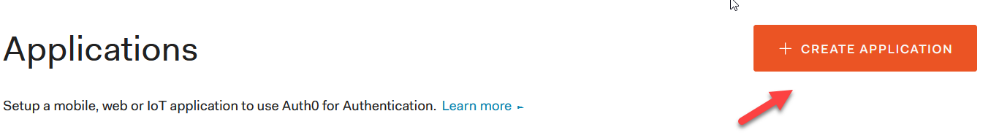

# **Web API Lab: Access Control - Auth0 Setup**
*Enda Lee 2021*

[TOC]

## Introduction

In this lab you will add access control based on user accounts. Users will be assigned roles which depending on their level of access, e.g., administrator,
manager, and customer.

### Access control involves two stages:

1.  Authentication – verify the identity of a user.

2.  Authorization – verify that the user has permission to access something.

All users will be required to provide their username and password to login.

While we could build all the required functionality from scratch or based on a library such as Passport (**<http://www.passportjs.org/>**), instead, we will use a third-party Identity Management Service.

Access control is very difficult to get right, and small mistake can lead to big security vulnerabilities. Using a specialised third-party service to manage identity, including user registration, login, password reset, authorization, MFA, SSO, etc. will greatly enhance the application security.

There are many services including Azure Active, Directory, AWS IAM, etc. and most provide a ‘free tier.’ We will be using Auth0 as it is very easy to set up and most of its features are available as part of a free developer’s account. 

To register your account (required for this lab) see: **<https://auth0.com/signup>**

Auth0 will issue a signed JWT (token) to the application, after successful authentication. The  token will contain that user’s privileges for the application (roles and scope). The app can then verify the integrity of the token using Auth0’s public key.

## Setting up users and apps in Auth0

To use Auth0, the application (both client and server side) must be registered as apps. User roles and permissions also need to be defined and assigned. A token obtained by the client app will passed to the API which can verify it with re-authenticating the user. For this to work the application(s) must be configured for single sign on.

### The API (server-side)

This is the server-side of the app. To configure, open the Applications menu in the Auth0 dashboard and then choose the API sub option:

Then add a new API application

Give your new API a name and an identifier – a URL is recommended but it will never be used publicly so you can enter anything here.

The signing key will be used to verify tokens, the default is to use public key and the RS256 algorithm.

Click create to register the new application.

*Now open settings for the new API*, e.g.

Later, some these settings will be used to by the application to communicate with Auth0 (e.g. for checking a user’s credentials). The Quick Start menu includes the settings required for some web platforms including Node.js

Further down the settings page:

1.  Enable Role Based Access Control (RBAC).

2.  Enable Add Permissions in the Access Token.

3.  Disable Allow Skipping User Consent.

These options enable the API to use Role based access control based on credentials included in a token.

Save the updated settings.

*Next open the Permissions page* (see links at top). Here you will add permissions (also called scopes) which can be assigned to users of this API. Add scopes for each of the database CRUD functions: (note the format, e.g. read:products)

### Auth0 configuration for the client-side web application

The client web app also needs to be configured. Users will be redirected to Auth0 for authentication. If successful, id and access tokens will be returned to the web app.

Go back to the Applications menu and choose Applications

The add a new application named Products Website, choosing the Single Page Web App type and create:

After its added, open the new application to view its settings, the configure the Application URIs and save changes. The client app will be hosted the on
<http://localhost:3000>

### Auth0 client web app configuration continued…

After saving click the Show Advanced Settings link, located just above the save button. In the OAuth section, enable the **OIDC Conformant** option. This will ensure conformance to the Open ID Connect specification for authentication and authorization ensuring that the token can be passed between the two (client and server) applications.

Sources of users for the application can be set in Connections – ensure that Database is enabled.

### The Logout URL

Now add <http://localhost:3000> to the list of allowed logout URLs. This is where the user will be redirected after logging out (typically a home page or sign in page):

Open the Tenant Settings (main account settings) using the link in the left menu (or direct link replace **elee-tudublin** with your account name:
[https://manage.auth0.com/dashboard/eu/**elee-tudublin**/tenant/advanced](https://manage.auth0.com/dashboard/eu/elee-tudublin/tenant/advanced))

Then add the URL and save

### At this point, the applications are configured:

API Settings:

Client Web App Settings:

## 

## Users and Roles

Now, add some users and roles for testing later. Choose Roles from the User Management menu. Then create three roles, Admin, Customer, and Manager.

### Set permissions for each role

For each role, in turn, click the 3 dots menu, the view details. Then open Permissions and click Add Permissions.

Choose the Product API, and select permissions (from the ones added in the API earlier). Tick all of the Scope options for the Admin Role:

For Manager, add all except delete, and for customer add only read permissions.

### Add Users and assign roles.

Users will be able to register later but for now add some users for testing purposes.

Choose Users from the User Management Menu

Then create the three users below:

After creating, use the … menu to assign a role to each (based on username). 

That completes the Auth0 configuration.

## Exercise

Explore the other Auth0 features, including token validity period (lifetime), password policy, and Multi-factor Auth.

