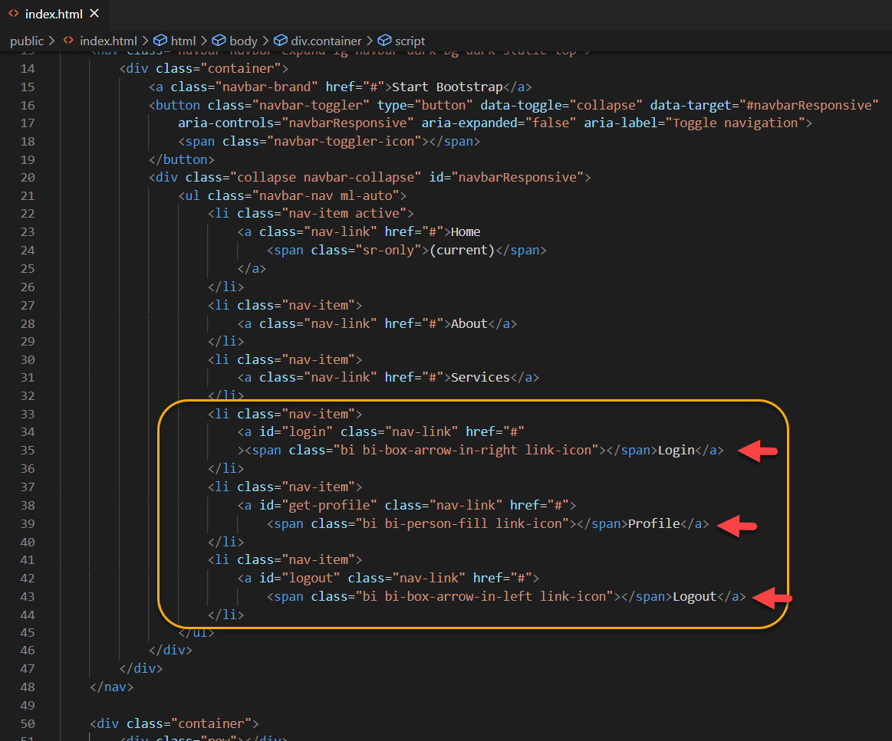
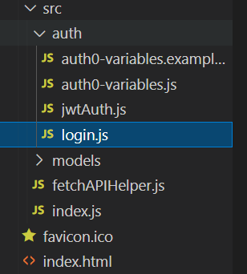
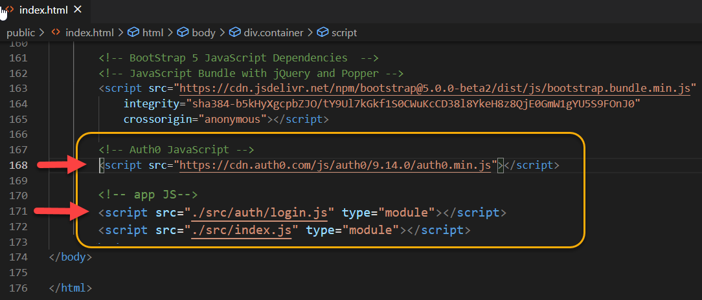
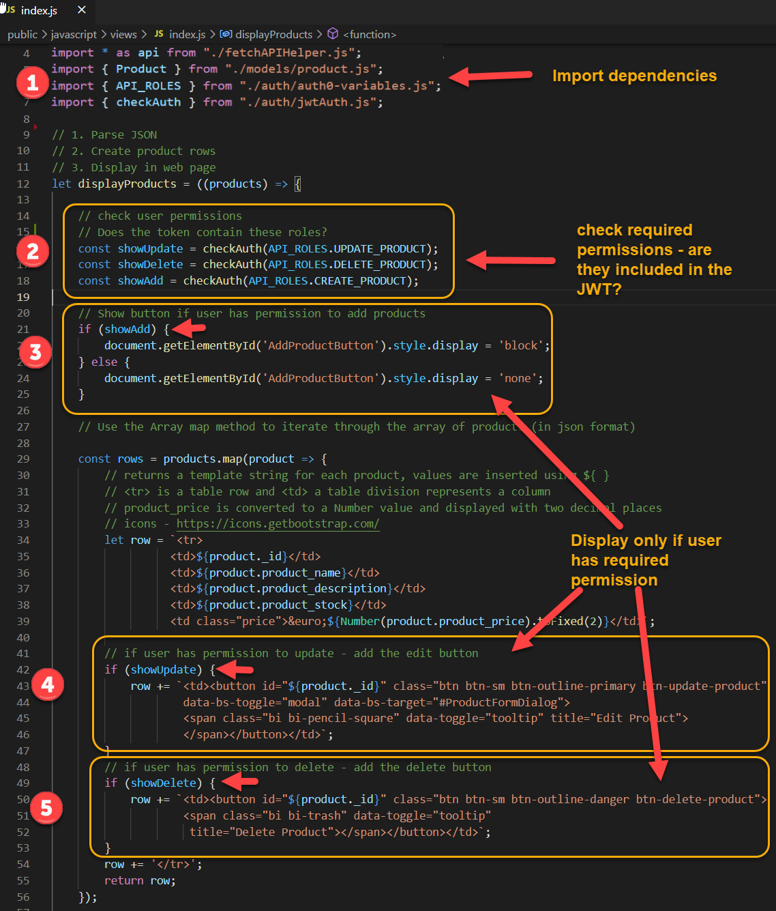

## **Web API Lab: Access Control - Client Setup**
*Enda Lee 2021*


[TOC]

## Introduction

The next step is to configure the client side so that users can register, login, logout, etc. via the Auth0 service.

After a successful login, Auth0 will return a token (**JWT**) to the client, which will then be sent in the **Authorization Header** of all requests to the server-side API as a **Bearer Token**.

## 1. Configuration and Setup

Start by adding a configuration file to store values from the Auth0 Product Website App. **Important - Use the values from your Auth0 setup**

These details can be obtained from the Quick Start section in the Auth0 settings for the app. They are used to connect to Auth0.

Create a new folder, named **auth**, in the **javascript** folder. Then add a new file, **auth0-variables.js** to the folder:


Important: You will need to obtain the correct values from your **Auth0** account – see the settings for the API and client web in the Auth0 setup
tutorial.


Code already in project - read the comments for details

### **auth0-variables.js**

```javascript
// Declare consts for Auth0 details required in this app

// api roles
const API_ROLES = {
  CREATE_PRODUCT : 'create:products',
  READ_PRODUCT : 'read:products',
  UPDATE_PRODUCT : 'update:products',
  DELETE_PRODUCT : 'delete:products'
};

// The Auth0 id for this app
const AUTH0_CLIENT_ID = '5n65Amb64bEMQcFYbDk95bhgmjvO5Ahm';

// Your Auth0 domain aka account/ tenant
const AUTH0_DOMAIN = 'elee-tudublin.eu.auth0.com';

// Users of this app require access to the API, identified by...
// This value is the 'Identifier' in your API settings 
const AUDIENCE = 'https://product-api';

// Where Auth0 should return the token to after authentication
const AUTH0_CALLBACK_URL = 'http://localhost:3000';

// Initialise Auth0 connection with parameters defined above
const auth0WebAuth = new auth0.WebAuth({
  domain: AUTH0_DOMAIN,
  clientID: AUTH0_CLIENT_ID,
  redirectUri: AUTH0_CALLBACK_URL,
  responseType: 'id_token token',
  audience: AUDIENCE
});

const auth0Authentication = new auth0.Authentication(auth0WebAuth, {
  domain: AUTH0_DOMAIN,
  clientID: AUTH0_CLIENT_ID
});

// Export consts
export {
  API_ROLES,
  auth0WebAuth,
  auth0Authentication
}

```


## 2. Add HTML links for Login, Logout, and Profile

Modify **index.html**, add links for singing in and out. The finished version will look like this (when the user is logged out:

And when logged in:


Add the new links to the end of the navigation list in the **Navigation**
section of the page. Note the **id** of each link – these will be used by the
Auth0 JavaScript event listeners later.



Copyable HTML:

```html
    <!-- Navigation -->
    <nav class="navbar navbar-expand-lg navbar-dark bg-dark static-top">
      <div class="container">
        <a class="navbar-brand" href="#">Start Bootstrap</a>
        <button class="navbar-toggler" type="button" data-toggle="collapse" data-target="#navbarResponsive"
          aria-controls="navbarResponsive" aria-expanded="false" aria-label="Toggle navigation">
          <span class="navbar-toggler-icon"></span>
        </button>
        <div class="collapse navbar-collapse" id="navbarResponsive">
          <ul class="navbar-nav ml-auto">
            <li class="nav-item active">
              <a class="nav-link" href="#">Home
                <span class="sr-only">(current)</span>
              </a>
            </li>
            <li class="nav-item">
              <a class="nav-link" href="#">About</a>
            </li>
            <li class="nav-item">
              <a class="nav-link" href="#">Services</a>
            </li>
            <li class="nav-item">
              <a id="login" class="nav-link" href="#"><span class="bi bi-box-arrow-in-right link-icon"></span>Login</a>
            </li>
            <li class="nav-item">
              <a id="get-profile" class="nav-link" href="#">
                <span class="bi bi-person-fill link-icon"></span>Profile</a>
            </li>
            <li class="nav-item">
              <a id="logout" class="nav-link" href="#">
                <span class="bi bi-box-arrow-in-left link-icon"></span>Logout</a>
            </li>
          </ul>
        </div>
      </div>
    </nav>
```


## 3. JavaScript to login/ logout via Auth0

The code here is modified version of the code provided by Auth0 – see the
documentation, including the JavaScript Quick Start guides for more details. It
includes functions to handle login, logout, access token storage, etc.

**src/auth/jwtAuth.js** Read the code comments for more detail:

```javascript
// check login status
function checkStatus() {
  // Get access tokem from browser sessionStorage
  const accessToken = sessionStorage.getItem('accessToken');
  // Check if expired
  const expirationDate = new Date(Number.parseInt(sessionStorage.getItem('expirationDate')));
  const isExpired = expirationDate < new Date();
  let status;

  // Log details to console
  if (!accessToken) {
    status = 'There is no access token present in local storage, meaning that you are not logged in.';
  } else if (isExpired) {
    status = 'There is an expired access token in local storage.';
  } else {
    status = `There is an access token in local storage, and it expires on ${expirationDate}.`;
  }
  console.log("status: ", status);

  // If logged in
  if (accessToken && !isExpired) {
    return true;
    // reload data??
  } else {
    return false;
  }
}

// Get access token (from session storage, etc.)
function getAccessToken() {
  return sessionStorage.getItem('accessToken');
}

// Save the token to session storage 
function saveAuthResult(result) {
  sessionStorage.setItem('accessToken', result.accessToken);
  sessionStorage.setItem('idToken', result.idToken);
  sessionStorage.setItem('expirationDate', Date.now() + Number.parseInt(result.expiresIn) * 1000);
  // check login status
  checkStatus();
}

// Check token validity + refresh if expired
function checkSession() {
  auth0WebAuth.checkSession({
    responseType: 'token id_token',
    timeout: 5000,
    usePostMessage: true
  }, function (err, result) {
    if (err) {
      console.log(`Could not get a new token using silent authentication (${err.error}).`);
      return false;
    } else {
      saveAuthResult(result);
    }
    return true;
  });
}

//
// docode a JWT
const parseJwt = (token) => {
  try {
    return JSON.parse(atob(token.split('.')[1]));
  } catch (e) {
    return null;
  }
};

//
// use jwt-decode to check if jwt contains a permission for the user
// return true or false
function checkAuth(permission) {
  // read the JWT
  const jwt = sessionStorage.getItem('accessToken');
  // check permissions (if a jwt was returned)
  if (jwt == null) {
    return false;
  }
  const decoded = parseJwt(jwt);
  return decoded.permissions.includes(permission);
} // End function

// Export functions
export {
  checkStatus,
  getAccessToken,
  saveAuthResult,
  checkSession,
  checkAuth
};
```

### 

### View functions to handle new login and logout links.

The purpose of this code (**login.js**) is to define event handlers for the new login, logout, and profile links. It will also display or hide the links based on logged in state.



#### The **login.js** code, read comments for details:

```javascript
// Get User log in status and update Login links.
// Assign event listeners to logi, logout, and profile links

// Import dependencies required to manage user login, etc.
import { auth0WebAuth, auth0Authentication } from './auth0-variables.js';
import { getAccessToken, checkSession, saveAuthResult, checkStatus } from './jwtAuth.js';

// Show hide menu links based on logged in state
function toggleLinks(loggedIn) {
    // true
    if (loggedIn) {
        // Logged in: hide login link
        document.getElementById('login').style.display = 'none';
        // show logout and profile links
        document.getElementById('logout').style.display = 'block';
        document.getElementById('get-profile').style.display = 'block';
    } else {
        // Logged out: Show login link
        document.getElementById('login').style.display = 'block';
        // show logout, profile, and add product links
        document.getElementById('logout').style.display = 'none';
        document.getElementById('get-profile').style.display = 'none';
        document.getElementById('AddProductButton').style.display = 'none';
    }
} // End Function

//
// Add Event Handlers for links
//
// Login event handler
// Call Auth0 to handle login (then return to the callback url – http://localhost:3000)
document.getElementById('login').addEventListener('click', (event) => {
    // Prevent form submission (if used in a form)
    event.preventDefault();
    // Call the Auth0 authorize function
    // auth0WebAuth is defined in auth0-variables.js
    auth0WebAuth.authorize({ returnTo: auth0WebAuth.redirectUri });
    console.log('Logged in');

}, false);

//
// Logout
// Call Auth0 to handle logout (then return to the callback url – http://localhost:3000)
document.getElementById('logout').addEventListener('click', (event) => {
    event.preventDefault();
    // remove tokens from session storage
    sessionStorage.clear();
    auth0WebAuth.logout({ returnTo: auth0WebAuth.redirectUri });
    console.log('Logged out');
}, false);

//
// get user profile from Auth0 
document.getElementById('get-profile').addEventListener('click', async (event) => {
    event.preventDefault();
    auth0Authentication.userInfo(getAccessToken(), (err, usrInfo) => {
        if (err) {
            // handle error
            console.error('Failed to get userInfo');
            return;
        }
        // Output result to console (for testing purposes) 
        console.log(usrInfo);
        document.getElementById('results').innerHTML = `<pre>${JSON.stringify(usrInfo, null, 2)}</pre>`;
    });
}, false);

//
// check jwt validity every 15 minutes
// refresh token if required
function checkUser() {
    toggleLinks(checkSession());
    setTimeout(checkUser, 900000);
} // End function

// When page is loaded
window.onload = (event) => {
    // Check for valid Auth0 token
    auth0WebAuth.parseHash(function (err, result) {
        if (result) {
            saveAuthResult(result);
            toggleLinks(true);
        }
    });
    // check login status after page loads
    // show and hide login/ logout links
    toggleLinks(checkStatus());
};

// Not yet required
// checkUser();

```


### Load the **Auth0 JavaScript** and other dependencies in **index.html**

It is important to load the **Auth0** scripts **BEFORE** the scripts which depends on its functionality.




## 4. Update the client application scripts.

Currently when the client accesses the API it does not include and **Authorization header**. In this step you will modify **fetchAPI.js** so that the JWT is included with each request.

### Include the token in HTTP headers.

The HTTP headers are defined in a function named **getHeaders()**. Modify so that the Auth0 token is included in the header:


## 5. Try it out

Start the server API so that it is running on <http://localhost:5000> Then client-side website **must be hosted** in a webserver for this to work.

Start the client on <http://localhost:3000>  

Then open in a browser and follow the Login link. This should show direct to the default Auth0 login page (for your Auth0 domain). Note that the form also includes options for signing up, password recovery, and login via Google or Microsoft. All these options are configurable in the Auth0 website.


Sign in using the Admin account created earlier. After login, you will be
redirected back to the client website <http://localhost:3000>

### Use the browser developer tools to see what happened in the background.

You should see that **tokens** for **id** and **access** are added to **session storage** after login. Session storage is used by the browser to store values for the current browser session. Values stored here can be read by JavaScript – so beware that they may be vulnerable to XSS attacks. **Local Storage** differs
in that values persist between sessions.


As you are logged in as an Admin user, you should be able to add, edit, and delete products. Also try the other users. Checking the request header in
developer tools will show how the token is sent to the API using the **Authorization: Bearer header**. Also check responses when a user tries to
access without permission.


### Decoding the token

Permissions for the token can be checked using <http://jwt.io> Copy the **accessToken** value from your browser and paste into the JWT debugger tool.
Note the permissions for this user:


## 5. Client-side Authorization

**Important**: This does not replace server-side validation and access control as client-side checking can be bypassed easily. Ideally a separate admin controller on the server-side should be accessed by a specialised administration site (e.g., host an admin site in addition to the  public site).

Client-side authentication and authorization is difficult and unreliable as an attacker will have access to the JavaScript code. However, it may be useful to display UI elements based on the user type. For example, only show buttons for add product, update, and delete when the user has permission to access those functions.

Roles for the API are defined in **auth0-variables.js**:


After a user logs in successfully, Auth0 returns an access token (JWT) which contains list of roles/ permissions assigned to that user. The **checkAuth()** function (**jwtAuth.js**) is used to check which permissions are contained in the token which can then be checked before granting access to protected resources:


### Update the **displayProducts()** function
Now we can modify **displayProducts()** so that it only displays the update/ delete button for users with permission to use them.


## 6. Test
Login as each of the three user types and compare, e.g.
**Admin view:**


**Customer/ ordinary user view:**


## Completed Example
Get the completed example from GitHub:

[**https://github.com/elee-tudublin/client-website-part6.2021-auth**](https://github.com/elee-tudublin/client-website-part6.2021-auth)
