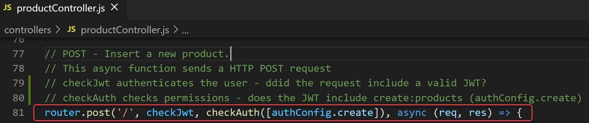

# **Web API Lab: Access Control - Server API Setup**
*Enda Lee 2021*


[TOC]

## Introduction

This lab continues from the previous Auth0 setup. The next step is to configure the server API so that it can control access to routes using the access token provided by Auth0. It is extremely important to control access on the server side as well as in the client.

The access control will be configured as Middleware which will perform user authentication and authorisation before protected controller functions are executed.

## Prerequisites

You should have registered for an Auth0 account and configured an API, Web application, Users, and roles before continuing. 


## 1. Configuration and Setup

Start by adding a configuration file to store values from the Auth0 API setup in the previous step. **Import: Use your own application settings**

Add auth_config.json to the config folder (or rename the example file).


The required settings can be found in the Auth0 dashboard. Choose the Product API App created earlier then open Quick Start and choose Node.js. Here you will find the values for audience, issuer, and the crypto algorithms. Note that these are app specific, so it is important to use the value for your app.


Add your values to auth_config.json. Also add the configured permissions (permissions tab in the Auth0 API settings).

Using a configuration file for these values makes changes easier if required.


## 2. The Auth Middleware

Next define the Middleware which will be responsible for authentication and authorization. It will use the Auth0 services, and the configuration value above to verify a user’s access token as required.

### Install Required Dependencies
Use npm to install the following required dependencies. Search <https://www.npmjs.com/> for more details about these packages.

**npm install express-jwt jwks-rsa express-jwt-authz**

### Define the JWT Auth Middleware

Add a new folder, named middleware, to the root of the app. Then add a new file named jwtAuth.js to the folder.


The code is modified from the Auth0 Quick Start example for Node.js with the addition of an authorisation check, using express-jwt-autz to compare required permissions with those contained in a JWT.

Read the comments for details.

**middleware/jwtAuth.js**
```javascript
// Dependencies
const jwt = require("express-jwt");
const jwksRsa = require("jwks-rsa");
const jwtAuthz = require('express-jwt-authz');

// Load the configuration settings
const authConfig = require("../config/auth_config.json");
 
// Authentication
//
// create the JWT middleware (these checks happen BEFORE controller endpoints)
const checkJwt = jwt({
    // Gets the JSON Web Key Set which will be used to verify the access token and issuer.
    // Sets other required parameters including the algorithm to be used
    // including the Public Key required to verify a JWT
    secret: jwksRsa.expressJwtSecret({
      cache: true,
      rateLimit: true,
      jwksRequestsPerMinute: 5,
      jwksUri: `${authConfig.issuer}.well-known/jwks.json`
    }),
  // 
    audience: authConfig.audience,
    scope: 'openid email profile',
    issuer: authConfig.issuer,
    algorithms: authConfig.algorithms
  });

//
// Authorisation
// Verify that the JWT includes scpecific permissions (from the JWT), passed as a parameter
//
// https://github.com/auth0/express-jwt-authz#user-content-options
// https://medium.com/javascript-in-plain-english/securing-a-node-js-api-with-auth0-7785a8f2c8e3
const checkAuth = (permissions) => jwtAuthz(permissions, {customScopeKey: "permissions" });
// ,checkAllScopes: true 

// Export
module.exports = {
  authConfig,
  checkJwt,
  checkAuth,
};
```

Note the authorisation check examines the **permissions** key of the JWT, as defined by the customScopeKey.

## 3. Protecting the productController functions

Now that the middleware has been defined, it can be used to control access to the controller to:

1.  Ensure that the user is authenticated (if required).

2.  Ensure that the user is authorised before allowing access.

Note that authorisation is only every carried out after authentication has succeeded. There is no point authorising a user who cannot be identified!

Start by importing the middleware in productController.js:


Now the routes can be protected. In this example we will require authentication for the create, update, and delete routes. In addition, we can check if the user has the required permissions. Here the create (POST) route:

Read comments for details:


Note the addition of the middleware functions checkJwt and checkAuth.

### Testing
Try to add a new product using Insomnia, what was the result? You should see:


Also testing with the client application. Verify that authentication and authorization checks work as expected.

## 4. Retrieving and using the Auth0 username (email)

At this point the API can use the JWT to authenticate a user by the presence of a valid token. The permissions for that user, contained in the token, can then be used to check if the user is authorized to access endpoints.

**But what if you need to link the Auth0 user with your database?**

This can be achieved by requesting the details from the Auth0 account/ tenancy. This will be achieved via a fetch call.

#### First install the axios package.

**npm install –save axios**

#### Create a user service.

The service will be used to get the required data. Add **userService.js** to the services folder:


#### Test
This test will retrieve the user profile in the products controller, and log it to the console (just before getting all products:


#### Output

When a request is received for products, get the token, find the user details, and log:


### Exercise

The finished application includes a user model, repository, service, controller, and SQL for creating a table app_user with sample data (database/database.sql).

First add the table and data to your database. Then add an endpoint to the user controller which returns the correct user details from the database (based on the user email returned by Auth0).
